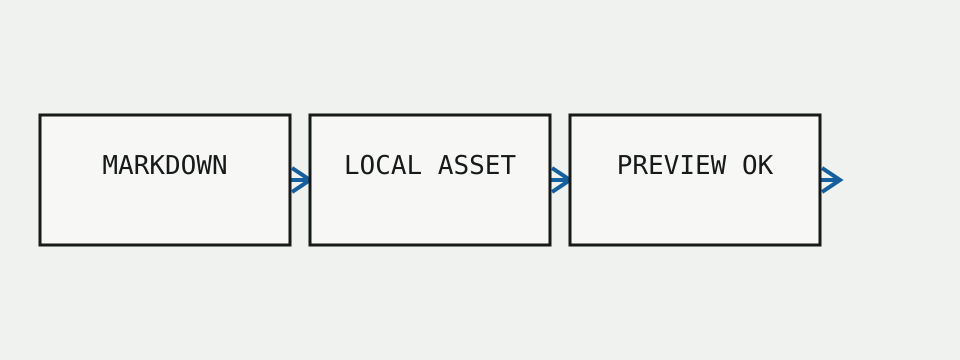
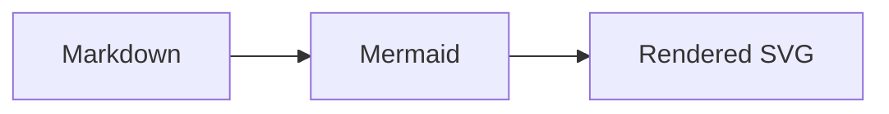

# Media proof

This controlled document verifies a local image, a Mermaid diagram and the centered reading width without exposing private content.

## Mermaid proof

The reading column should remain centered, calm and comfortably wide on a desktop window.
